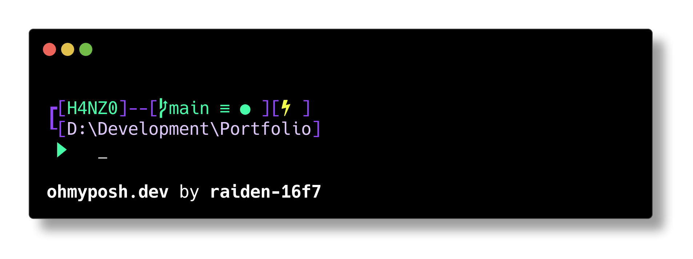

# My Oh-my-posh Theme: CosmicCascade



Welcome to the **ComsmicCascade** Oh-my-posh Shell Theme! This theme combines the soothing shades of green and purple to create a visually pleasing and functional shell experience.

## Features

- A harmonious blend of green and purple colors.
- Clear and easily readable text for improved readability.
- Thoughtfully selected prompts and highlights.
- Smooth transitions and elegant design elements.

## Installation

1. Clone this repository to your local machine.
   
For windows navigate to oh-my-posh installation directory
   ```
   e.g C:/Users/YourName/AppData/Local/Programs/oh-my-posh/themes/
   ```
2.Paste the JSON file there.

3.Paste the following command to check if working.
   ```
   oh-my-posh init pwsh --config "$env:POSH_THEMES_PATH\CosmicCascade.omp.json"
   ```
## Customization

Feel free to customize this theme according to your preferences. You can modify the colors, prompts, fonts, and more.

## Credits

- Theme created with love by [@Raiden-16f7](https://github.com/raiden-16f7).
- Original design inspired by [@JanDeDobbeleer](https://github.com/JanDeDobbeleer/oh-my-posh/blob/main/themes/nordtron.omp.json)


